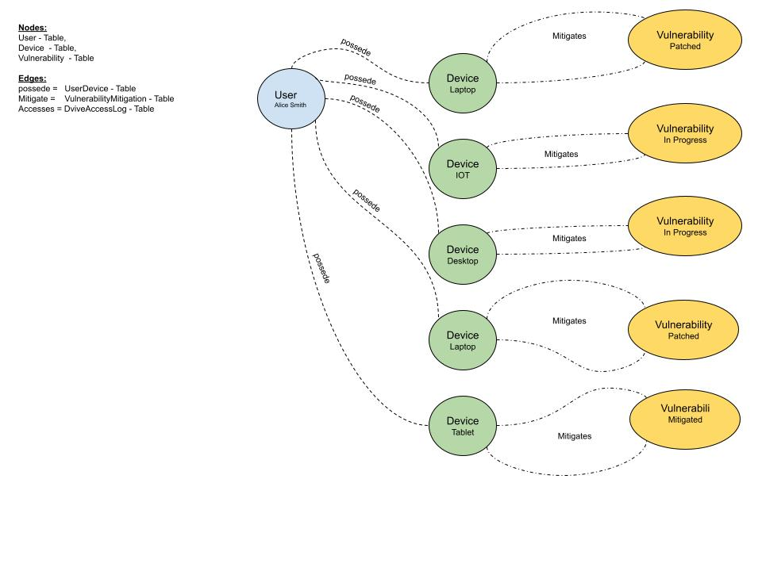

# Cloud Spanner and Spanner GraphDB: A Cybersecurity Use Case.

This document provides an overview of Cloud Spanner and its graph database capabilities (Spanner GraphDB), 
along with a specific example of how they can be used to model and query cybersecurity data.

## Cloud Spanner:
Cloud Spanner is a globally distributed, scalable, and strongly consistent database service offered by Google Cloud. 
It combines the benefits of relational database features with horizontal scalability, providing high availability and 
strong consistency across multiple regions and continents.

## Key Features:
### Global Scale:        
Spanner can handle massive datasets and high transaction volumes while maintaining 
                        consistent performance across multiple geographic locations.
### Strong Consistency:  
Spanner provides globally consistent transactions, ensuring that all users 
                        see the same up-to-date data, regardless of their location.
### High Availability:   
Spanner is designed for continuous availability, with automatic failover and 
                        replication to minimize downtime.
### Relational Database: 
Spanner supports SQL and familiar relational database concepts, 
                        making it easy to use for developers with SQL experience.

## Spanner GraphDB
Spanner GraphDB extends Cloud Spanner with native graph database capabilities, 
allowing you to model and query interconnected data using graph concepts and the Graph Query Language (GQL).

### Key Benefits:
Integrated Graph and Relational: Spanner GraphDB seamlessly integrates graph capabilities with Spanner's relational features, allowing you to use both SQL and GQL to query your data.
No Data Migration: You can map existing relational tables to graph schemas without migrating data, making it easy to add graph functionality to your existing Spanner databases.
Powerful Graph Queries: Spanner GraphDB supports GQL, enabling you to express complex traversals and relationships between data entities.
Scalability and Performance: Leveraging Spanner's underlying infrastructure, Spanner GraphDB provides excellent scalability and performance for graph queries.
Cybersecurity Use Case: Schema and Queries
This example demonstrates how Spanner and Spanner GraphDB can be used to model and query cybersecurity data.


## Use case Schema:
The following tables were created to represent users, devices, vulnerabilities, and their relationships:

User Table: Stores information about users (id, name).
Device Table: Stores information about devices (id, registration_time, is_compromised, device_type).
Vulnerability Table: Stores information about security vulnerabilities (id, severity_score, risk_level, discovery_time, exploitability_score).
DeviceAccessLog Table: Represents access logs for devices (id, device_id, access_time, location).
VulnerabilityMitigation Table: Tracks mitigation efforts for vulnerabilities (id, vulnerability_id, mitigation_time, mitigation_status).
UserDevice Table: Represents the ownership relationship between users and devices (id, device_id, assignment_time).
DeviceSecurityEvents Table: Stores security events related to devices (id, event_timestamp, event_details).

These tables are then mapped to a property graph named SecurityGraph using the following edge tables:

__DeviceAccessLog:__ Device accesses Device.

__VulnerabilityMitigation:__ Device mitigates Vulnerability.

__UserDevice:__ User Possede Device.

## Graph Queries:
Several GQL queries were developed to analyze the cybersecurity data:

User, Device, Vulnerability Query: Finds vulnerabilities mitigated on devices Possede by a specific user.

Device Access Log Query: Analyzes access patterns between devices.
User, Device, and Access Logs with Aggregations Query: Calculates access ratios for devices Possede by a user.

Device Security Events Query: Retrieves security events related to devices accessed by a compromised device.

Multi-hop Access Query: Shows how devices access other devices that access further devices.
Security Flow and Remediation Query: Identifies compromised devices and high-severity vulnerabilities, showing the flow of potential security issues and their mitigation status.
These queries demonstrate the power of GQL in traversing and analyzing relationships between different entities in the cybersecurity domain.


**The Files:**
1) resources/create_tables.sql -> the script to the Table Schema
2) resources/insert_data.sql   -> Inserting Data into the tables
3) resources/create_graph.sql  -> Create the Graph Node and Edges
4) resources/queries.sql   -> Six demo GQL queries
5) python_script/creat_env.py
 
## Demo of a GQL query
```
GRAPH SecurityGraph
MATCH 
  (user:User{name:"Alice Smith"})-[Possede:Possede]->(device:Device)-[mitigates:Mitigates]->(vulnerability:Vulnerability)
RETURN 
  device.device_type AS device_type, 
  mitigates.mitigation_time AS mitigation_time, 
  mitigates.mitigation_status AS mitigation_status, 
  vulnerability.id AS vulnerability_id, 
  vulnerability.severity_score AS severity_score
ORDER BY mitigates.mitigation_time;
```

### The visualization of How the QUery will apper in a GraphDB
The diagram  helps visualize how the query  fetch all the owned device by "Alice Smith" present the vulnerability mitigation of this device.



